# Lesson 01: Setting up a Modern Mapping Environment and Workflow

## Table of Contents
<!-- TOC -->

- [Lesson 01: Setting up a Modern Mapping Environment and Workflow](#lesson-01-setting-up-a-modern-mapping-environment-and-workflow)
    - [Table of Contents](#table-of-contents)
    - [Overview](#overview)
    - [Installing and using the VS Code text-editor](#installing-and-using-the-vs-code-text-editor)
    - [Using Git and GitHub](#using-git-and-github)
        - [Introduction: What is Git?](#introduction-what-is-git)
            - [A brief background to Git and history of version control](#a-brief-background-to-git-and-history-of-version-control)
        - [Setting up an (educational) account with GitHub](#setting-up-an-educational-account-with-github)
        - [Installing GitHub Desktop](#installing-github-desktop)
        - [Cloning a repository down to our local machine](#cloning-a-repository-down-to-our-local-machine)
            - [Organizing your local directory structure](#organizing-your-local-directory-structure)
            - [Cloning from the GitHub website](#cloning-from-the-github-website)
            - [Cloning from the GitHub Desktop client](#cloning-from-the-github-desktop-client)
        - [Editing and creating content in a repository](#editing-and-creating-content-in-a-repository)
            - [Editing a file in a repository](#editing-a-file-in-a-repository)
            - [Adding new files to a Git Repository](#adding-new-files-to-a-git-repository)
        - [Synchronizing local commits to the remote repository](#synchronizing-local-commits-to-the-remote-repository)
        - [How does Git work?](#how-does-git-work)
        - [Collaboration and your Git/GitHub workflow in map671](#collaboration-and-your-gitgithub-workflow-in-map671)
    - [Definitions](#definitions)
    - [Video](#video)
    - [Additional Resources:](#additional-resources)

<!-- /TOC -->

## Overview

As almost all the software involved in a modern web mapping workflow involves plain text files (information encoded in human-readable characters), the essential tools for a web mapper make handling these text files as easy as possible. In this lesson, we will introduce two specific tools we'll be using throughout this course and beyond, and the process of using them.

**1. VS Code** is a free and open-source text editor for working with code and design. It has many features that you’ll come to love, such as:

* code syntax highlighting to make code more legible
* beautifying your code to make it more legible
* auto-complete for when you don’t want to type or remember that long variable name, and
* live server preview (so you can test your application or web page on your local machine to see how it will appear and behave when hosted on a remote server).

**2. Git**. Git is a software program, and what's known as a "distributed version control system." It records changes to the various files in your project (a "repository" or "repo" for short) as you progress through your work. Using Git allows you to track different versions and, if (or when!) you mess up, go back to a previous version. Git also facilitates better collaboration on web projects.

This lesson will familiarize you with using these tools and establish a workflow we'll be using throughout the course to create maps and publish them to the web.

## Installing and using the VS Code text-editor

Throughout the web mapping process, and this course, we'll be spending a lot of time writing code. We write the code in plain text, and we can do this with any text/code editor. However, having a powerful editor makes the process much easier and more enjoyable. Let's first get at least one editor installed on our machine.

Download and install VS Code from the website:[VS Code](https://code.visualstudio.com/).

There are other good text editors that you can also install along with VS Code. Popular ones among web mappers and developers include [Sublime Text](http://www.sublimetext.com/), [Brackets](http://brackets.io/), and Atom, a "A hackable text editor for the 21st Century," [https://atom.io/](https://atom.io/).

If you have any trouble getting VS Code installed and launched, consult the [VS Code Overview](https://code.visualstudio.com/docs/setup/setup-overview), which you may want to read anyway. Get to know your tools! Once installed, feel free to open VS Code and play around:

* Check out all the [Extensions](https://marketplace.visualstudio.com/) you can install and use with VS Code.
* Explore the different visual themes under [Color Themes](https://code.visualstudio.com/docs/getstarted/themes).
* We highly recommend watching the short videos, [using VS Code](https://code.visualstudio.com/docs/getstarted/introvideos).

One extension you want to install is [Live Server](https://marketplace.visualstudio.com/items?itemName=ritwickdey.LiveServer), which we'll discuss more below. Go ahead and do this now. In the file menu, got to **View -> Extensions**. Type "Live Server" in the *Search Extensions* field. Then, select the extension and **Install**. VS Code might ask you to click **Reload** to activate the extension.

<!-- 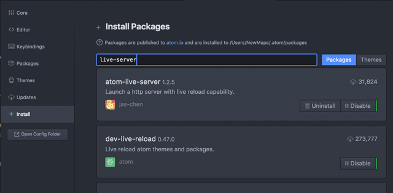  
Figure 01. Installing the atom-live-server package -->

Before we start using VS Code for our New Maps Plus mapping, we need to first get our Git process up and running.

## Using Git and GitHub

Git is a version control system (VCS) for tracking changes in computer files and coordinating work among multiple people. Within Map 671, we'll use Git to keep track of changes to our files and code, as well as to share and submit our work on the web with the instructor and other students. Within this module, we're going to cover Git in both a conceptual and practical sense.

For more practice using Git, consider running through Codeacademy's [Learn Git](https://www.codecademy.com/learn/learn-git) (approximately 2 hours).

### Introduction: What is Git?

Git is a **Distributed Version Control System (DVCS)**. Okay, but what's a version control system (VCS)? A VCS records all changes made to a computer file or set of files. This allows you to review any changes made to the files under version control and allows previous versions of files or projects can be recalled at a later time. If you mess something up, accidentally delete or copy over a file, you can retrieve an earlier copy of that file.

We'll note now that there are two ways of installing and using Git on your computer system: With a desktop software client and/or via command line (using the Command Prompt on Windows or the Terminal on a Mac).

**Recommended:** We'll primarily use [GitHub Desktop Client](https://desktop.GitHub.com/) because of the simplicity and ease of use. You might notice the website announces, "The new native." The software was recently updated and is significantly different than the previous version; a common theme we'll notice with open source software.

**Optional:** To use Git outside of the GitHub Desktop client (e.g., in VS Code or on the command line), [download and install Git](https://git-scm.com/downloads). If you wish to pursue the [advanced command line approach](https://git-scm.com/docs), that's great! But understand that we're not explicitly teaching this method within the course and that the course instructor may not have the time to troubleshoot potential problems with you.

The process for connecting with GitHub is a little more complicated as well, so if you want to make life easier for the time being, stick with the Github Desktop Client.

#### A brief background to Git and history of version control

VCSs have been used for a long time. A very simple form of version control is simply making backups of your files or project directories and storing on a local computer or network system. Of course, this requires one to keep careful track of files and file names, often manually. Developers use centralized Version Control Systems (CVCSs) to collaborate with others on projects, which used a single server and database to store files and keep track of all versioned files and changes. Examples of these CVCSs include Subversion and Perforce. While CSVSs were better than developers keeping their versions of files on their local machines, this centralized approach also provides a single point of failure. If the server crashed (or even worse, became corrupted), the project was still at risk of being lost.

To address this risk, in recent years developers have migrated their workflow to Distributed Version Control Systems (DVCS) such as Git, Mercurial, Bazaar, and Darcs. The primary benefit of a DVCS is that rather than keeping a single backup of a project, every client who "clones" the project fully mirrors the entire repository. This approach "distributes" a full backup of project files among all local computers working on the project.

Git takes a particular approach to version control. Rather than making a full backup of the project with each version (as other VCSs do), Git tracks and records changes to a project in a hidden repository database. A change can be adding a space to a line of text or changing a file name. Git will identify *exactly* what and where changes have occurred in your project. To log a desired change in a project, one needs to "commit" those changes. A commit stores a "snapshot" of all changes in the repository since the last commit and gives that commit a unique reference. If a file hasn't changed, then there is no need to log anything in the Git database, which makes it very efficient compared with other VCSs. 

One powerful feature of Git is the ability to "revert" undesired changes in a repo. A revert is similar to an "undo" operation commonly found in many software applications. Because Git retains all commits (i.e., "snapshots" of changes to the project), one can revert changes made early in the project without affecting subsequent changes.

Another advantage of Git is that repositories are always downloaded, stored, and manipulated locally  (i.e., no need for server requests), which means Git runs very fast, and you can work even without an Internet connection.

Today, another huge advantage of using Git is its close integration with [GitHub](https://github.com/). **GitHub** is a company that provides a Git-enabled platform to share your Git repositories. This is very powerful as it allows other people to collaborate with you on the same repository, and you can even share your projects with the broader public via open web pages. During the course, you will also use this mechanism to submit and share your assignments with your instructors.

### Setting up an (educational) account with GitHub

To get started with GitHub, you first need to create an account (actually, you'll have already created one to access this information, but here it is again).  

Navigate to [https://github.com/](https://github.com/) and sign up with a username, password, and email address. **Make sure you use your @uky.edu address as you need it for the next step.** It also may be useful to use the same username that you use in other online professional/academic accounts for consistency across your social media branding.

Once you create your account, take a moment to update your profile (under **Your profile**) by clicking on the avatar upper-right corner. Uploading an image of yourself (or some other fun image) is nice, as well as giving your name, location, and a URL to a website if you have one.

GitHub is free to use, but it also has [paid plans](https://github.com/pricing) that offer additional features. Included with our free plan is unlimited private repositories. This is very helpful while we’re still learning as we may not want our stumbles and ugly code to be visible to the entire world. Another advantage of using private repositories are when working for a client who wants to keep data and development private for the time being. All lesson repositories in New Map Plus are private with two collaborators, you and the instructor.

GitHub offers many advanced features free-of-charge to students! Once you’re signed up, go to [GitHub Education](https://education.GitHub.com/) and click on the blue "Get the Pack" button.

  
GitHub Education

Sign in with your GitHub account (if you haven’t done so already), click "Request a Discount," and follow the instructions. GitHub will ask you to submit a request using your `@uky.edu` account. 

### Installing GitHub Desktop

Now that we have our remote GitHub account set up on the web let's get the GitHub Desktop running on our local computer. Depending on your operating system, download the GitHub Desktop Client from [https://desktop.github.com/](https://desktop.github.com/).

Once downloaded and opened, GitHub Desktop will ask you to walk through some configuration steps. Enter your GitHub username and password. If you see the section on providing your identity for commit messages, supply your name and email. Please use your real name so that your colleagues and instructors can identify you in the repository's commit history. This allows the Desktop Client application to pull down files from a remote repository, as well as to add, commit, and push changes to files up to a remote repository.

Once the configuration is successful, you should see an empty GitHub window. We’re finally ready to roll!

For further documentation on this process, see [Getting Started with GitHub Desktop](https://help.github.com/desktop/guides/).

Now that we have our GitHub account connected to the Desktop Client, we'll use it to complete four important processes that we'll use each week: 
1. Cloning a repository down to our local machine
2. Editing and creating new content in this repository
3. Synchronizing content between our local and remote repositories
4. Working with a collaborator

### Cloning a repository down to our local machine

Each week a URL is provided in Canvas to the lesson module hosted as a GitHub repository. When you click on this link, Github will spawn a private repository for you on the [New Maps Plus Github account](https://github.com/newmapsplus) using your username as a suffix to the repo name (e.g., *map671-module-01-username*). Only you and the instructor have access to this repo.

**NOTE:** Throughout this lesson, when "username" is written you should substitute your own GitHub username.

To begin working in the module, you need to clone this remote repository. Cloning creates an identical copy that can be synchronized across different computers and collaborators.

#### Organizing your local directory structure

Before you begin, select a good location on your computer to save your repositories. It doesn't matter where it is, as long as you remember where. We recommend that you create a root directory for this program, e.g., "nmp", where you keep all projects for this and future courses. It would make sense to create then one more directory named something like "map671" and clone your weekly repo into that directory.

Let's look at an example of a directory structure you might use. Consider the following Windows OS example:

```sh
C:/Users/boyd/Documents/nmp/map671/map671-module-01-boydx/
```
This is a directory path to our first module. This shows that the folder `map671-module-01-boydx` is inside the folder `map671` which is inside the folder `nmp`. A view in Windows Explorer might look like the following:

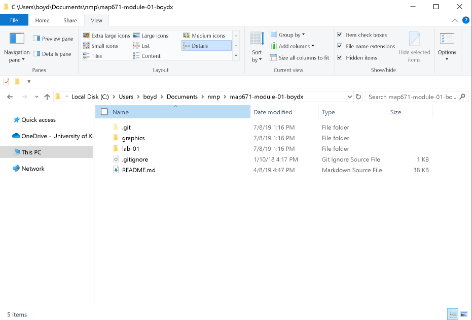  
Example directory in Windows Explorer

#### Cloning from the GitHub website

After you accept the lesson invitation, you should land on GitHub's web page for the repository.  If you are reading this document online, find the **Clone or download** green button. Click the button and then **Open in Desktop**. 

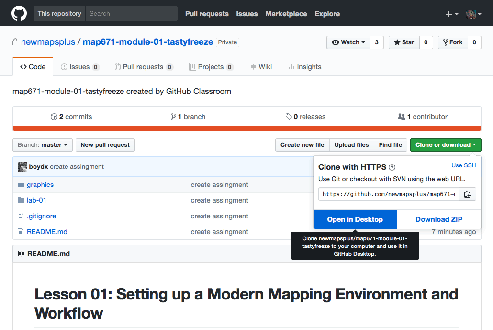  
Cloning the weekly module repository in GitHub

#### Cloning from the GitHub Desktop client
 
Another way to clone a repo is to use Github Desktop. With your GitHub Desktop application open, click on the main menu and find **File > Clone Repository...**. This presents you with a list of the remote GitHub repositories associated with your GitHub account(s) and username (you must be logged in to GitHub). Navigate to your repo or search for it within the **Filter** (if this is your first GitHub repository, then there will only be the one) and choose **map671-module-01-username**. You'll note that it is listed under the newmapsplus organization within Desktop Client.

Regardless of how you clone, you should now have an exact copy of the module stored locally. It's time to start editing!


First, let's verify the clone by looking at the repository within your local file/directory structure. Right-click on any repo name within GitHub Desktop and choose **Open in Finder** or **Open in Explorer** (depending on your OS).

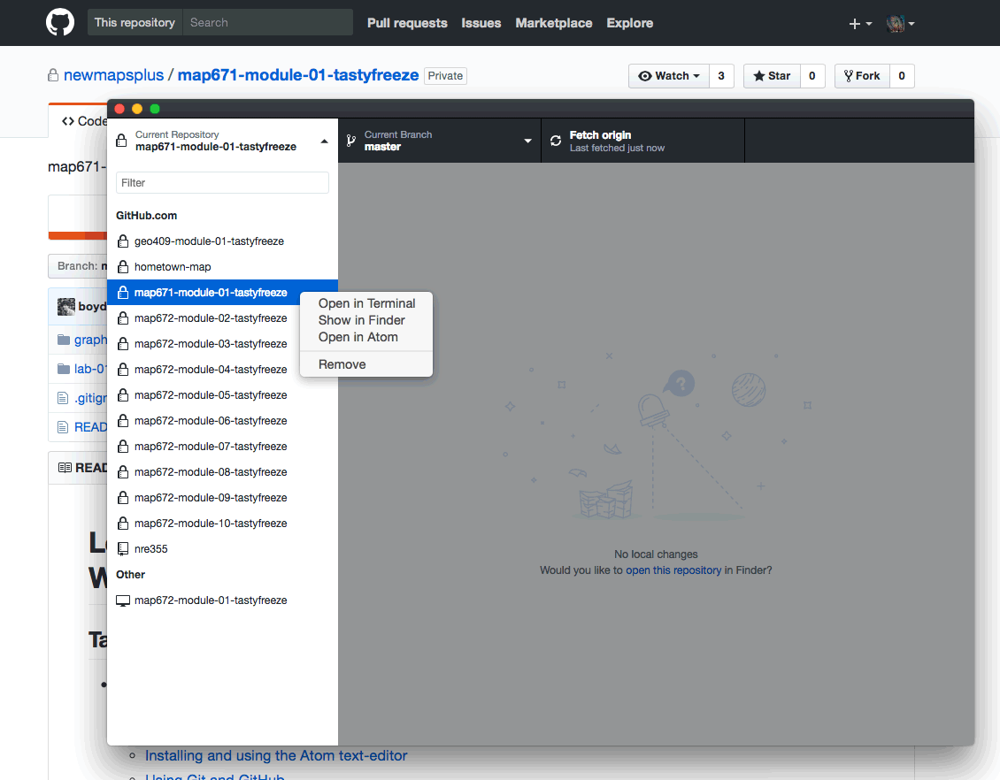  
Opening the local repository directory through Finder

When you open this repository in your file/directory structure, you'll see that the repository is contained within a directory named *map671-module-01-username*. Within this repo, you'll see the *README.md* file that is this documentation that you are now reading.

You may also see a (hidden) directory named *.git* (if not you can enable your Operating System to view hidden files on your computer). The *.git* directory is used internally by Git to track your files and log the changes. Deleting it will delete the record of your repository. A Git repository also uses relative paths with respect to this *.git* directory, so you can easily move the entire *map671-module-01* directory to another location on your drive or another computer (or USB drive) and continue working with the files while Git tracks your changes!

### Editing and creating content in a repository

Switch back to GitHub Desktop. Find two tabs at the top-left of the application. Click on **Changes** and it should "No Uncommitted Changes." This indicates that you currently have no committed changes recorded by Git, and the panel below indicates "0 changed files."

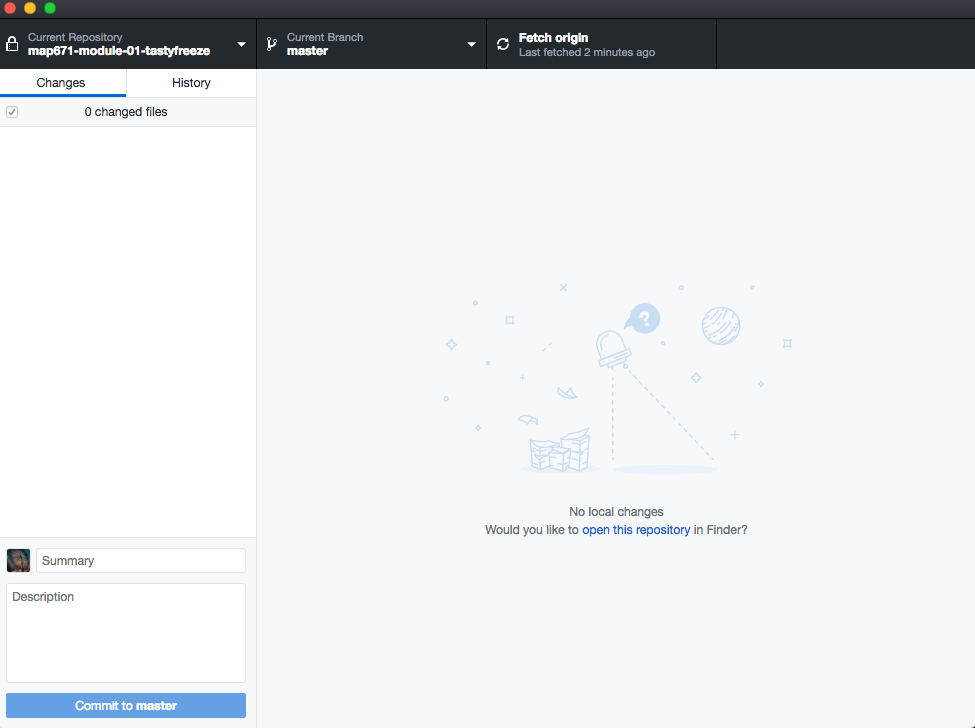  
No uncommitted changes in the repository

Next, click on the **History** tab. This will show you all the committed changes to your repository. Here we see there is the commit history of all changes made to the repository.

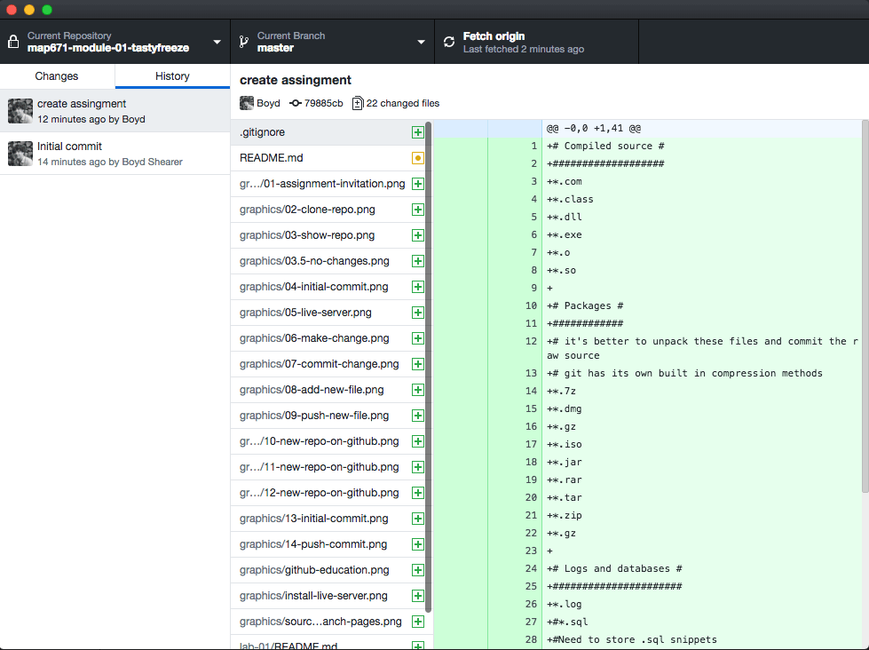  
Viewing the commit history of the repository

#### Editing a file in a repository

First, let's open our repository in our text editor. Launch your text editor if not already open. Choose **File -> Open**, and navigate to your local copy of the *map671-module-01-username* repository. **IMPORTANT:** throughout this course, it is best to **open the entire directory** of the repository, rather than directly opening a single file. Doing so conveniently keeps the file/directory accessible to you within a text editor's file tree in the sidebar. You can also right-click the repository in GitHub Desktop and click **Open in Visual Studio Code** or under its file menu with **Repository -> Open in Visual Studio Code**. (If you don't see your text editor, open **GitHub Desktop -> Preferences -> Advanced** and select your text editor.)

Now, let's view the *lab-01/index.html* file in our text editor and examine the HTML, the Hypertext Markup Language that browsers render to pretty web pages. Don't worry if it all looks like Greek right now; we'll be taking a closer look at these web standards over the following weeks and especially in Map 672 and 673. This file is a basic template that we'll use to serve our maps this semester. 

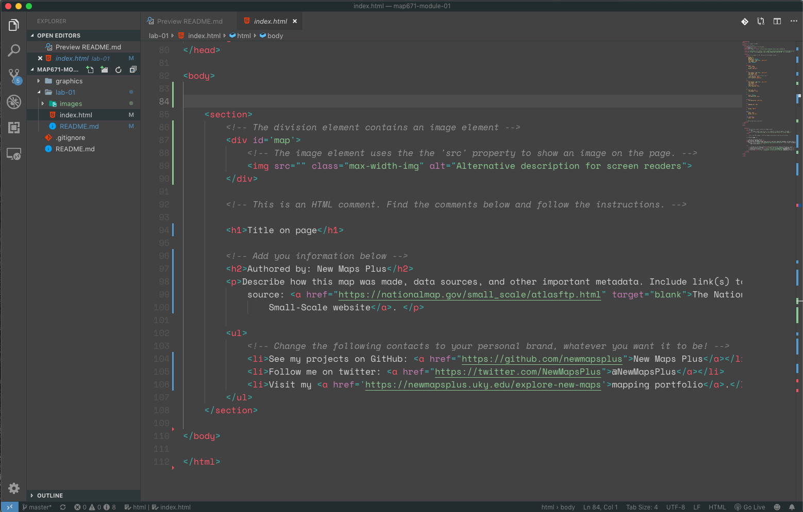  
Viewing HTML in VS Code with syntax highlighting

The main thing to notice is the code syntax highlighting. Some chunks of code are instructions that tell the browser how to draw the content, some chunks of code are the content, and other chunks are comments for the developer, which are ignored by the browser.

Now let's look at the page rendered in our web browser. Select **View -> Command Palette...** in the file menu and type "Live Server" and select the **Live Server: Open with Live Server**. You can also click the **Go Live** found on the lower application status bar.

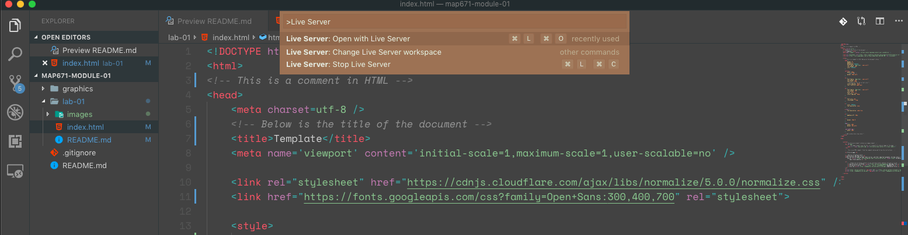  
Access Live Server in the Command Palette

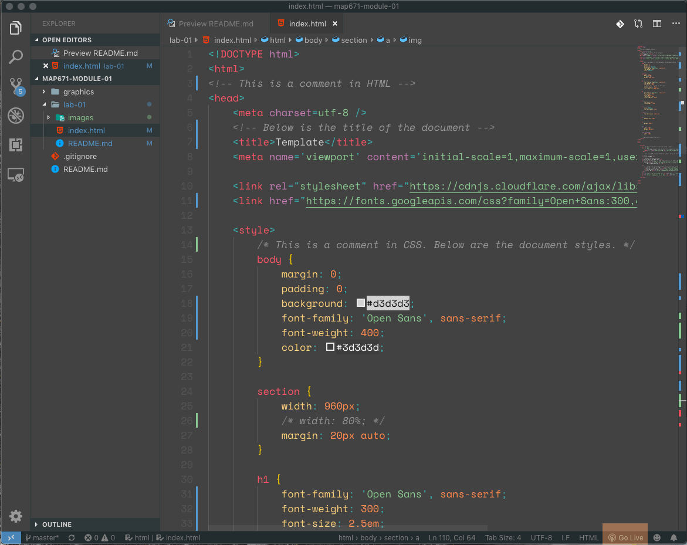  
Access Live Server in the lower application status bar

Go ahead and launch the live server. If you see the file/directory structure within your web browser, click on **lab-01/** folder. The application should open the *index.html* page. You need not type "index.html" because web servers by default "surface" that file name, i.e., automatically serves that file when only a directory is given in the URL. Your code is now rendered!

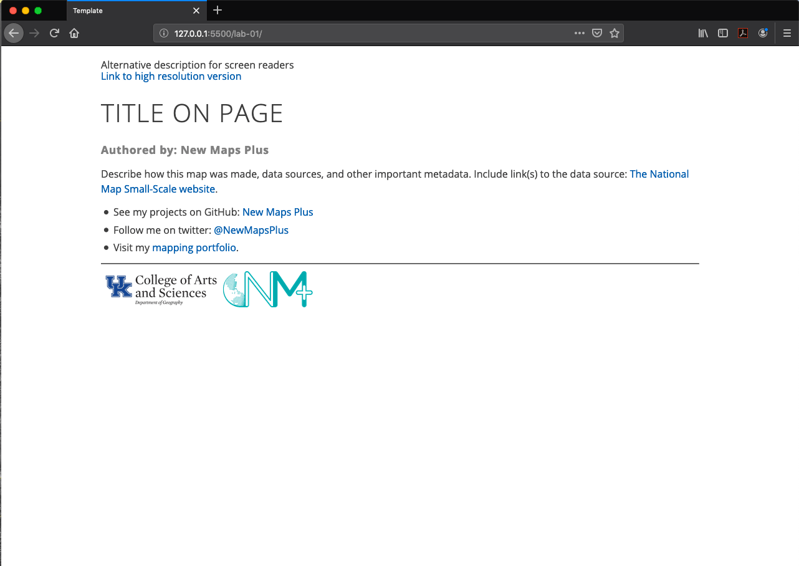    
Live Server enabled

Well, that's not a map! Let's edit a few lines of HTML to add a static map to our page. (A static map is used to distinguish a single image from a slippy map, one that pans and zooms.) We'll be doing a lot of minor edits like this over the next few weeks. Again, don't feel like you need to know everything about HTML and CSS to make simple changes; the next courses will dive deeply into these topics. If you want to to learn how to make more modifications that what we do here, then a good place to start is the [W3Schools online tutorials](https://www.w3schools.com/).

OK, the map! We've selected a historic map from 1944 about global agricultural patterns. The author of this hand-drawn map is Edwin Raisz, a master cartographer. The map was downloaded from the [David Rumsey Map Collection](https://www.davidrumsey.com/). If you don't know about this collection, it certainly can be an inspiration for your map design. Make the following modifications to the file and **save your changes**.

On line 95, we need to edit the `img` element and add the source of the map image so it can display on the page. The source of the image relative to the *index.html* file is *images/raisz_world_ag_production_1944_1200px.jpg*. The filename for this JPEG image tells us the author, the image theme, date of production, and the image size, 1,200 pixels wide. How do we know it's a JPEG image? The file extension is *.jpg* (and if you don't see the file extension in your File Finder or Windows Explorer, you should enable viewing file extensions in your OS).

Change line 95 to the following.

```html

```

This tells the browser to find the source of the image file relative to the location of the *index.html* file. The image file is in the folder *images* in the same folder as *index.html*. 

Now, let's change line 97, so the viewer can access the higher resolution version of the file.

```html
<a href="images/raisz_world_ag_production_1944_6000px.jpg">Link to high resolution version</a>
```

The `a` element is the *anchor* element and links to resources not included on the current page. In our case, we're linking to the 6,000 pixel-wide version of the map.

**IMPORTANT:** Always remember to save your changes to your file in your text editor before looking for the result in the browser or GitHub Desktop. After you save the changes, switch to your web browser. You can see your image has been "live-updated" in the browser.

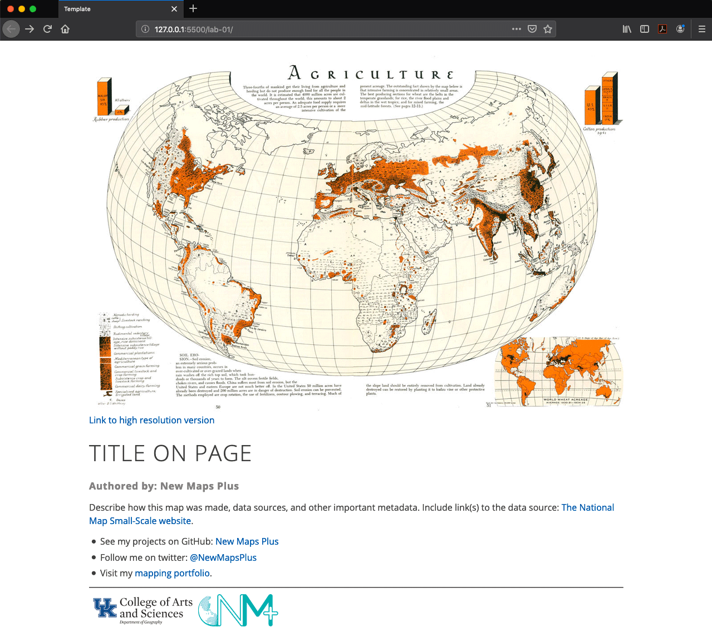    
Updated web page

Now, switch back to GitHub Desktop. We can see at the top of the client that there is "**1 changed file.**" Click on this tab. In the right-hand panel, you can see the previous text highlighted in red, and the new text highlighted in green. In Git-speak, this is called a "diff" — it shows the difference between two versions of the same file. You have removed lines with a small "-" and have added those with a small "+." Green and red colors indicate key additions/removals.

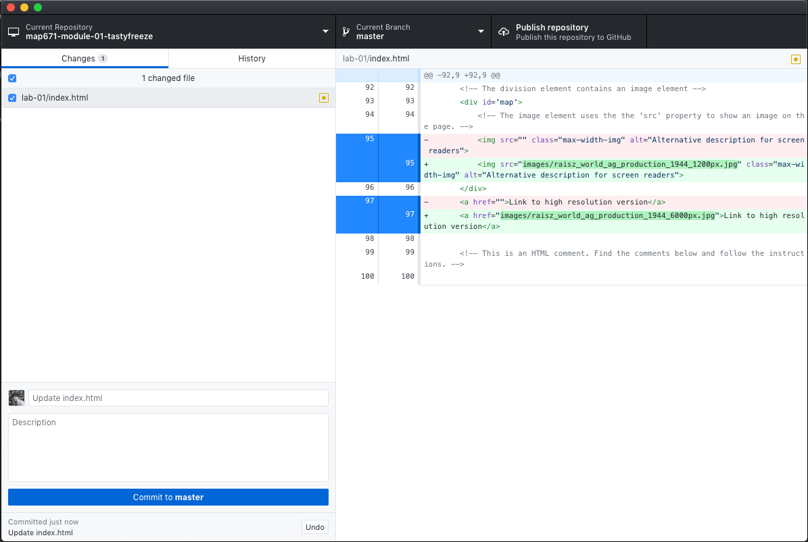  
Seeing one uncommitted change in GitHub Desktop

Next, let's commit this change to our repository. A commit bundles anything that has changed and creates a snapshot of the current state of the repository. Each commit then becomes an individual snapshot that you can access later.

Every commit to a repository requires a commit message. These messages should be descriptive of the changes you made to the files since the last commit. The convention is to use present tense verbs (i.e., "add static map image" or "add GeoJSON file to project").

Within the GitHub Client, enter a commit message. You can also add a longer description of the commit (such as for commits that involve many changes to several files). When complete, hit **Commit to master**. Note that we add this commit to the master branch (we'll talk more about branches and branching later on).

In this case, I'll enter the commit message "add static map image" and click **Commit to master**.

After clicking **Commit to master**, GitHub Desktop returns to show there are **"No Uncommitted Changes."** Clicking back to the **History** panel how displays the most recent commit message.

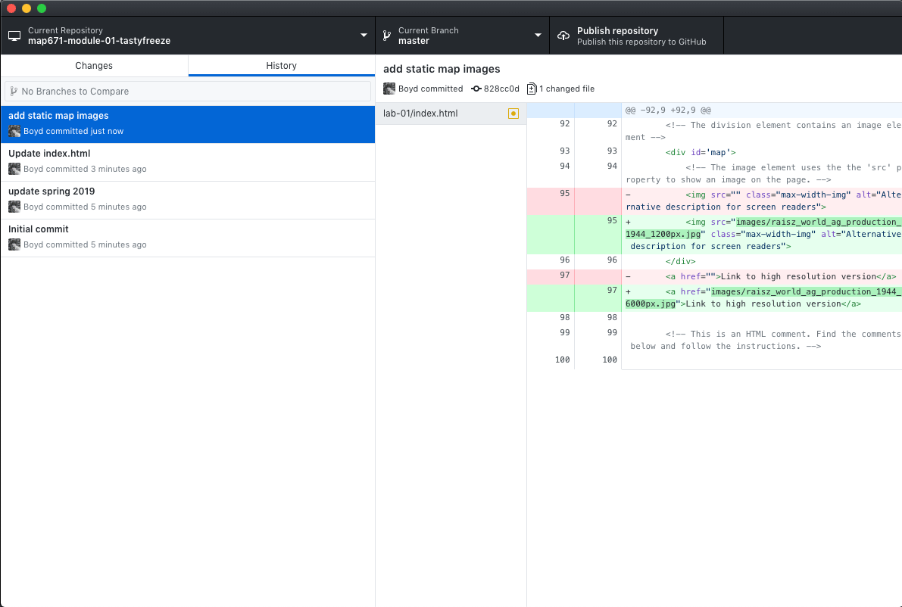  
History panel of GitHub Desktop showing the last two commits

**Question:** How often should we commit our work to the repository? Commits are snapshots of a project that we can roll back to if a problem emerges. They also provide opportunities to comment on changes. Think about making commits when you've finished a particular task or made significant progress on a mapping process, or perhaps when you've reached a stopping place for the day. If you've puzzled through something difficult or coded a good solution, then go ahead and "save" this work with a commit. But there's no need to commit every new change to the script or file.

#### Adding new files to a Git Repository

We just modified and saved a file and then committed that change to our repository. Now let's add a new file to our repository.

Choose **File -> New File** within your text editor, which will open a new untitled document. Save this file within the *lab-01/* directory and name the file *reading-reaction.md*. Make sure the file is saved within your *map671-module-01-username/lab-01/* directory and not somewhere else in your filesystem, and that you include the *.md* file extension.

The extension *.md* stands for Markdown, which is a [text-to-HTML](https://daringfireball.net/projects/markdown/) conversion tool for writing content on the web. GitHub users store a lot of text information in Markdown, and at NMP, we've written the lessons and laboratory assignments for you in Markdown as well. You'll be learning and practicing some Markdown as we go! Read more about Markdown in  [The Ultimate Guide to Markdown](https://blog.ghost.org/markdown/).

Within this *reading-reaction.md* file, copy and paste the following Markdown within your text editor (include the pound sign as it creates a top-level heading in Markdown):

```md
# My reaction to How to Lie with Maps
```

Save those changes to the *reading-reaction.md* file. Then switch back to your GitHub Desktop. Once again, you should see that there are changes to the repository, and GitHub Desktop shows these as uncommitted changes ("1 Uncommitted Change" here). On the left, GitHub DeskTop shows us on which file those changes occurred in (in this case, the *reading-reaction.md* file located within *lab-01/* directory).

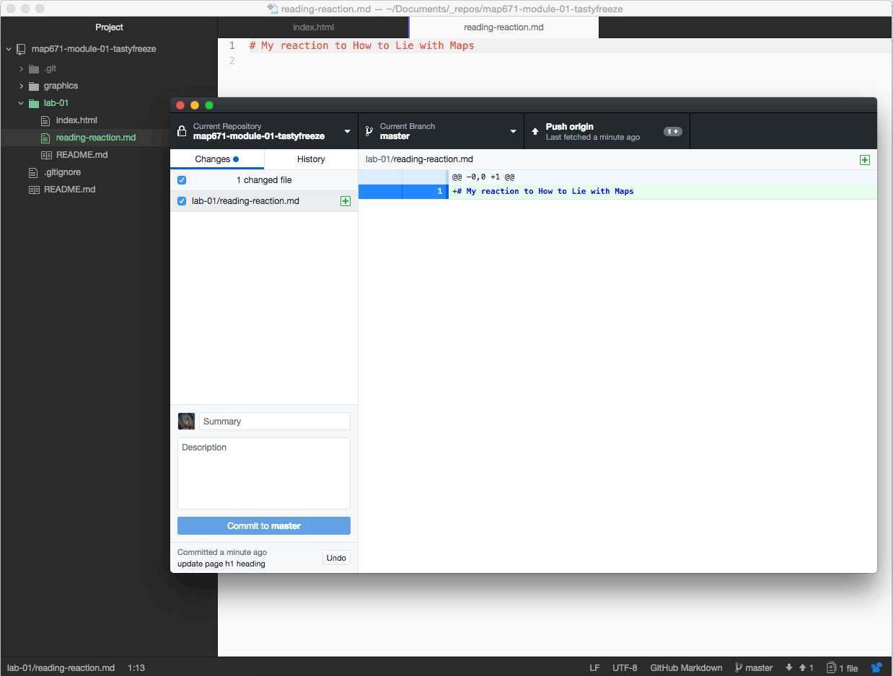  
Figure 10. The Markdown file added to the repository but not committed

Again, we can add a commit message and then commit this change to the repository. Write a message such as "add markdown file for floating sheep" and click **Commit to master**. Once again, GitHub Desktop commits that addition to the project's repository and displays that there are now no uncommitted changes.

So far we've modified the *index.html* file and created a new *reading-reaction.md* file. We've safely stored these within our local Git repository. But, we haven't created a backup of these files. If our local machine became corrupted or lost, we'd lose this work. Let's now push these changes up to our remote GitHub account.

### Synchronizing local commits to the remote repository

GitHub Desktop recently had a **Sync** button at the top right, which offered a manual process to synchronize remote and local repos. The new Github Desktop (that you are likely using) replaces the sync process with a **Fetch** operation that works continuously in the background. A fetch will collect all of the remote changes and compare them to your local repository. Since you are the only one working in your repo, you shouldn't expect any changes at this point. The upside of fetch (versus the old sync) is that it keeps a repository synchronized across multiple computers.

To put a local commit on your remote repo, you need to **Push** the commit, and Github Desktop will change the right-hand button from _Fetch origin_ to _Push_. If the button says _Pull_, then the remote repo was altered outside (and ahead) of your local repo and you need to pull in the changes to stay synchronized. Go ahead and push your changes to the remote.  

Now switch back to your assignment repository on the New Maps Plus GitHub site within your web browser. Refresh the page to see that your local changes are transferred (or "pushed") to the remote web server.

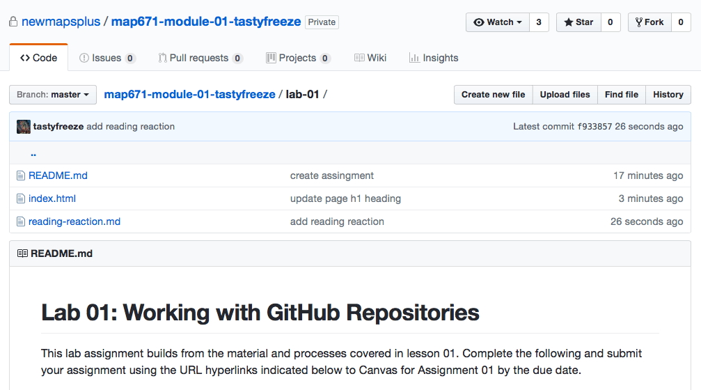  
Changes to the local repository have been pushed to the remote.

You can see which files were changed and their associated commit messages. Behold, the transparency of GitHub!

Note that you don't need to push up changes every time you make a local commit. When you are stepping away from the project for a while, push the changes to back up the project on the remote web server. Read more about [syncing your repositories](https://help.github.com/en/desktop/contributing-to-projects/syncing-your-branch)

Let's take a quick moment to conceptually review what Git's been doing with our files.

### How does Git work?

Files (such as your *index.html* file) reside in one of three states when working with Git: 1.) **modified** (the file has been updated, but the changes are not recorded), 2.) **staged** (the changes have been added to the Git record), and 3.) **committed** (the changes have been safely stored in the Git database).

So, the basic workflow for working with Git is as follows:

1. modify your files in the working directory
2. stage the files
3. commit the files

As we saw above, GitHub Desktop masks a bit of the Git process, essentially staging the file(s) for the commit and making the commit in one step. If and when you begin using Git using the command line, there will be more steps involved for successfully using this process. For now, GitHub Desktop makes it simple to work locally, commit changes, and occasionally pushing these changes with the remote server.


### Collaboration and your Git/GitHub workflow in map671

We're hosting the content for each module of map671 course on the New Maps Plus GitHub account within its repository. Each week you'll begin by cloning down the repo using the URL provided in the week's Canvas Module. Then, edit the files on your local machine, committing changes as you go. For your final project, you'll be asked to create a repository on your account and add files there.

When ready to submit each weekly assignment, push up any recent commits to the remote repository. Your remote and local repositories should now be identical. Copy the repo's URL and paste in the Canvas Assignment, so the instructor knows you've submitted. Remember that late assignments incur a 10% reduction per day unless excused by the instructor beforehand. The instructor will then clone that repo to their local computer, make suggested changes in a new branch, and submit those changes to the student as a "pull request". We'll cover these steps after you submit your assignment in Canvas.

You can read rendered Markdown files (i.e., files with a *.md* extension) within a text editor or on GitHub's website. You can preview Markdown files in VS Code by right-clicking the file's tab and selecting **Open Preview**. If you want to preview Markdown in the style that GitHub renders on its website, search for the extension "Markdown Preview Github Styling" and enable it. In both methods, you should see images and find usable hyperlinks.


## Definitions
* **Git**: A (distributed) version control system that allows you to manage (and revert) changes to (text) files.
* **GitHub.com**: An online platform, built on top of Git, that allows for online collaboration and sharing of Git repositories.
* **GitHub Desktop**: A program that allows for the management of Git repositories through a graphical user interface (instead of the command line).
* **Repository**: A directory containing all of a project’s files, managed by the Git workflow.
* **Clone**: Make a local copy of a remote repository that can be synchronized.
* **Remote repository**: A Git repository that exists on a remote server, most often the GitHub.com platform.
* **Commit**: Save and log changes to a repository (verb). Also, a specific record of a project’s changes (noun).
* **Push**: Put local changes to the remote repository.
* **Pull**: Incorporate changes from the remote repository into the local repository.
* **Fetch**: A utility that helps synchronize local and remote repositories in the background, i.e., automatically notifies you if remote changes are found (and pulls these changes in some cases).
* **Revert**: Undoing one (or more) commit(s).
* **Branch**: A specific *context* of a repository. Often used to work on a specific feature or new idea.
* **Merge**: Branches can be merged back into the main branch. This brings all the commits made on a specific branch into the main context of the project. E.g., if a certain feature proves useful, it can be added to the main project at that time.
* **Pull requests**: An announcement that changes have been pushed to a branch in a repository on GitHub. 

## Video

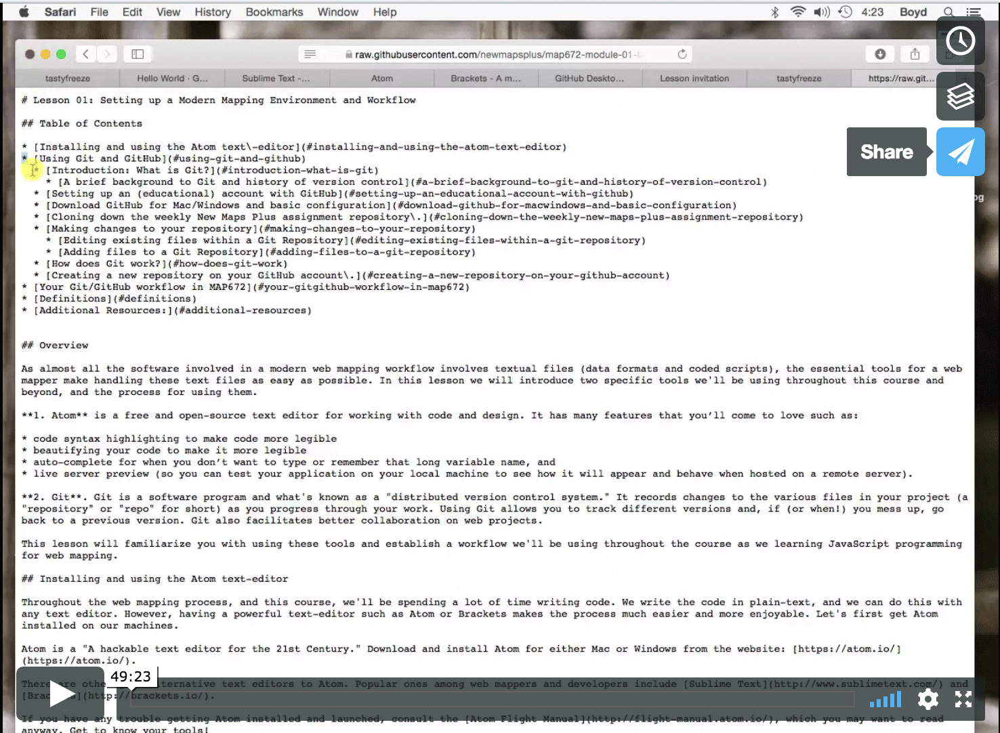

Each lesson has an instructional video that you can access through Canvas. This lesson's video walks you through setting up your workflow. 

## Additional Resources:

* [Set Up Git](https://help.github.com/articles/set-up-git/)
* [Create a Repo](https://help.github.com/articles/create-a-repo/)
* [For A Repo](https://help.github.com/articles/fork-a-repo)
* [Be Social](https://help.github.com/articles/be-social)
* [GitHub Desktop Client reference](https://help.github.com/en/desktop)
