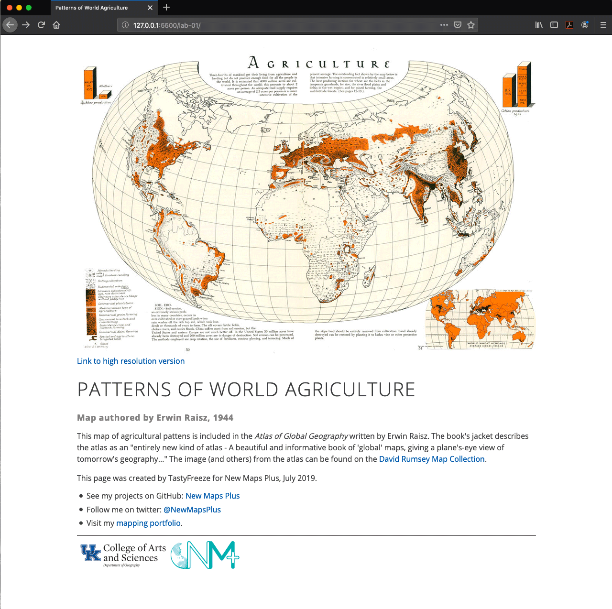

# Lab 01: Working with GitHub Repositories

This lab assignment builds from the material and processes covered in lesson 01. Complete the following and submit your assignment using the URL hyperlinks indicated below to Canvas for Assignment 01 by the due date.

## Part I. Understanding the lesson (4 pts)

Create a new file named *quiz-01.md* within your *map671-module-01/lab-01/* directory,

Then write short answers (1–2 sentences) to the following questions within it. Commit the file to your repository with a good commit message.

This is a markdown file, and you'll be writing Markdown syntax within it. Be sure to checkout GitHub's [Markdown Cheatsheet](https://github.com/adam-p/markdown-here/wiki/Markdown-Cheatsheet). You will be graded on making a well-formatted page so please practice. For example, to make a ordered list, you simply use numbers before each new line:

```markdown
1. My answer to question one ...
2. Here goes number two!
3. Mmmm ... this one is tough.
```

### Quiz:

1. What is the difference between Git and GitHub and how do they relate?
2. What is the difference between the GitHub website ([https://github.com](https://github.com)) and the GitHub Desktop Client we installed on our machine?
3. Within a Git development process, how would you go about making changes to a file and backing those changes up on a remote server? Be specific in the steps you'd take.
4. What is the purpose of the README.md file in a Git repository?

## Part II. Understanding map distortion (3 pts)

Read the first two chapters in Mark Monmonier's *How to Lie with Maps*
(The book is available on Canvas for this lesson). The entire book is an essential read for any map maker.

Edit the file named *reading-reaction.md* that you created within lesson 01. Using Markdown, write responses to the following questions:

1. What are the three elements of a map that are sources of distortion?
2. What is a verbal scale for the ratio scale, "1:12,000"?
3. In a short paragraph, compare equal-area and conformal map projections. Which is right?

Commit your changes to the file and Push to the remote repo when complete.

## Part III. Finishing your first static map web page (3 pts)

Open the map web page you edited in the lesson, *lab-01/index.html*. Notice that page content does not match the map image. Find metadata about the map in the *lab-01/images/readme.md* and apply that information to page. The goal is to recognize the HTML syntax enough to apply minor but essential changes. Let's walk through the changes. 

1. One line 8 we have the `title` element of the document. This is what appears in search engine results and in the browser title bar. Change the contents of the `title` element to:

 ```html
 <title>Patterns of World Agriculture</title>
 ```
2. The `h1` element is the top-level heading element. It appears on the page and most likely is very similar to the page's title.
 ```html
 <h1>Patterns of World Agriculture</h1>
 ```
3. The `h2` element is a second-level heading and we use it for the map author's name.
 ```html
 <h2>Map authored by Erwin Raisz, 1944</h2>
 ```
4. The `p` element is a paragraph. Let's describe the map and our work in the lesson. Note the `a` element is an anchor or link to an external resource, e.g., a link to the map on the David Rumsey Map Collection.
 ```html
 <p>This map of agricultural pattens is included in the <i>Atlas of Global Geography</i> written by Erwin Raisz</i>. The book's jacket describes the atlas as an "entirely new kind of atlas - A beautiful and informative book of 'global' maps, giving a plane's-eye view of tomorrow's geography..." The image (and others) from the atlas can be found on the  <a href="https://www.davidrumsey.com/luna/servlet/detail/RUMSEY~8~1~219847~5504801:Agriculture?sort=Pub_List_No_InitialSort%2CPub_Date%2CPub_List_No%2CSeries_No&qvq=q:raisz;sort:Pub_List_No_InitialSort%2CPub_Date%2CPub_List_No%2CSeries_No;lc:RUMSEY~8~1&mi=34&trs=272#" target="blank">David Rumsey Map Collection</a>.</p>
 <p>This page was created by Greg Campbell-Cohen for New Maps Plus.</p>
 ```
5. Finally, we have the `ul` (unordered list) and `li` (list item) elements to customize. The template points links to New Maps Plus. Change them to match your social media branding.
  ```html
 <li>See my projects on GitHub: <a href="https://github.com/tastyfreeze">TastyFreeze</a></li>
 <li>Follow me on twitter: <a href="https://twitter.com/boydshearer">@BoydShearer</a></li>
 <li>Check out my <a href='https://flickr.com/photos/28640579@N02/'>trail photos</a></li>
 ```

 An example of a completed page might look like the following image.

     
 Example of completed page

## Challenge

At the heart of Git is the ability to create branches of your repo to test changes before you make them permanent. A branch is separate project within your repo that is managed the same way as the Master branch, the default main branch in GitHub. Consider the master branch as the most stable (best looking) version of your project. Your *lab-01/index.html* web page renders the master branch of your repo by default. What if you wanted to explore changes to your web page but didn't want to publish them until they were polished? The solution is to create a branch of your repository and explore more exotic formatting in the *index.html* document.   

1. Create a branch of your *map671-module-01-username* repository in GitHub Desktop and publish it to your remote repo. In GitHub Desktop menu, click on **Branch -> New Branch**. 
2. Modify *index.html* with HTML examples from *https://www.w3schools.com/html/*, e.g., try adding images to your page. Find some examples of various agricultural process and add them to the page. Don't forget to add captions!
3. Commit and push the changes to your remote repo.
4. Create a pull request to notify me that you've made a change that you would like consider before adding it to the master branch. In GitHub Desktop menu, click on **Branch -> Create Pull Request**. 

## Submission

Paste the URL link within the Canvas Assignment 1 by the due date, e.g. https://github.com/newmapsplus/map671-module-01-username